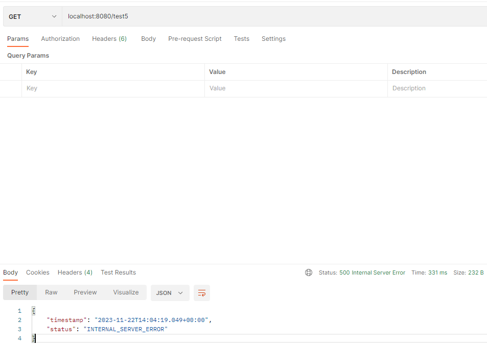

# ErrorAttribute

- Spring Boot에서는 `ErrorAttributes` 인터페이스를 구현한 `DefaultErrorAttributes`를 통해 기본적인 예외에 대한 응답 모델을 제공한다.

```java
public interface ErrorAttributes {
    
    String ERROR_ATTRIBUTE = ErrorAttributes.class.getName() + ".error";
    
    default Map<String, Object> getErrorAttributes(WebRequest webRequest, ErrorAttributeOptions options) {
        return Collections.emptyMap();
    }
    
    Throwable getError(WebRequest webRequest);

}
```

- `ErrorAttributes` 인터페이스에는 단 두 가지의 method를 정의한다.
- `DefaultErrorAttributes` 클래스에는 두 method를 구현했기 때문에 별도로 `ErrorAttributes`를 등록하지 않으면 사용할 수 있다.

```java
@Component
public class CustomErrorAttributes extends DefaultErrorAttributes {

    @Override
    public Map<String, Object> getErrorAttributes(WebRequest webRequest, ErrorAttributeOptions options) {
        Map<String, Object> errorAttributes = new HashMap<>();
        errorAttributes.put("timestamp", new Date());
        errorAttributes.put("status", HttpStatus.INTERNAL_SERVER_ERROR);
        return errorAttributes;
    }
}
```

- 위와 같이 `DefaultErrorAttributes` 클래스를 상속받아서 `CustomErrorAttributes`를 등록하여 기본 응답 모델로 사용할 수 있다. 안에 존재하는 method들을 오버라이드 할 것인지는 각각 선택할 수 있다.
- 여기서는 반환할 속성들만 지정해보았다.

### `DefaultErrorAttributes`를 사용하는 경우
- 

### `CustomErrorAttributes`를 사용하는 경우
- 