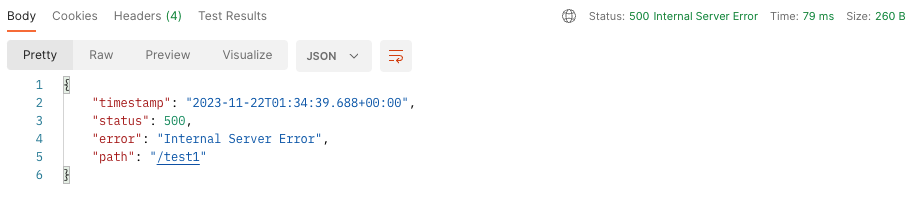
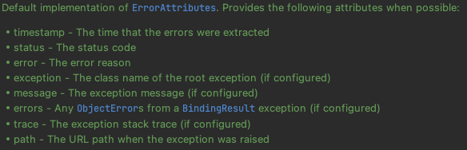

# Default Error in SpringBoot

- Spring Boot에서는 발생하는 예외에 대하여 적절한 방식으로 처리하여 /error로 매핑하는 전역 오류 페이지를 제공한다.

- 따라서 별도의 어떠한 예외처리를 하지 않더라도 예외가 발생한다면 다음과 같은 응답을 얻을 수 있다.



- 그 이유는 Spring framework에서 인터페이스로 제공하는 `ErrorAttributes` 인터페이스를 Spring Boot에서 `DefaultErrorAttributes` 구현하여 제공하기 때문이다.



- 구현 클래스에서는 기본적으로 다음과 같은 속성들을 보유하고 제공할 수 있는 것으로 보인다.

```java
@Override
public Map<String, Object> getErrorAttributes(WebRequest webRequest, ErrorAttributeOptions options) {
        Map<String, Object> errorAttributes = getErrorAttributes(webRequest, options.isIncluded(Include.STACK_TRACE));
        if (!options.isIncluded(Include.EXCEPTION)) {
            errorAttributes.remove("exception");
        }
        if (!options.isIncluded(Include.STACK_TRACE)) {
            errorAttributes.remove("trace");
        }
        if (!options.isIncluded(Include.MESSAGE) && errorAttributes.get("message") != null) {
            errorAttributes.remove("message");
        }
        if (!options.isIncluded(Include.BINDING_ERRORS)) {
            errorAttributes.remove("errors");
        }
        return errorAttributes;
}

private Map<String, Object> getErrorAttributes(WebRequest webRequest, boolean includeStackTrace) {
        Map<String, Object> errorAttributes = new LinkedHashMap<>();
        errorAttributes.put("timestamp", new Date());
        addStatus(errorAttributes, webRequest);
        addErrorDetails(errorAttributes, webRequest, includeStackTrace);
        addPath(errorAttributes, webRequest);
        return errorAttributes;
}
```

- 내부에서 사용하는 속성을 반환하는 메서드와 오버라이드가 가능한 속성을 반환하는 메서드 2가지가 있는 데 다양한 속성들 중에서 옵션에 message, errors, trace, exception이 포함되어 있지 않다면 기본적으로 제거하는 코드가 구현되어있다.

- 따라서 Spring Boot에서는 예외가 발생했을 때 별도의 처리를 하지 않더라 4가지 속성에 대한 반환값을 확인할 수 있다.

- 다음글에서는 Spring framework에서 사용가능한 예외처리, Spring Boot에서 사용가능한 예외처리를 각각 알아보자.