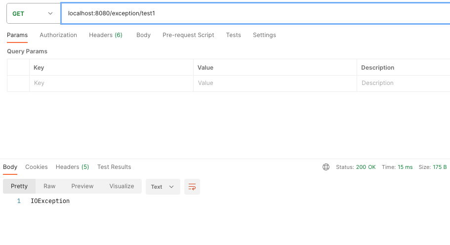
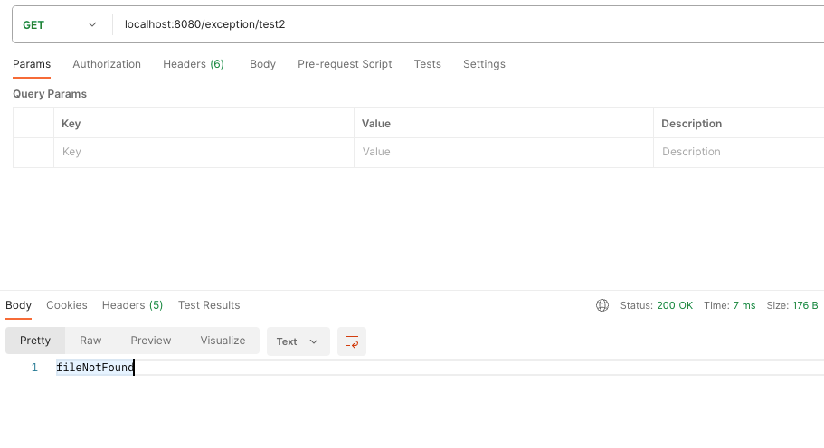
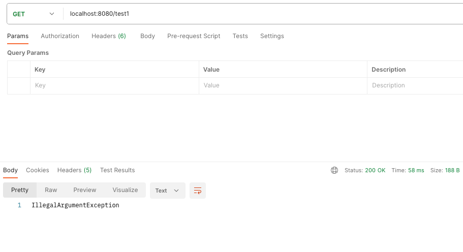
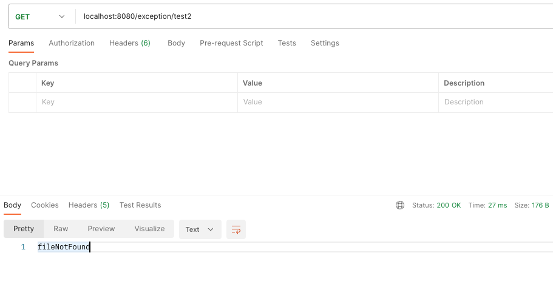

# HandlerExceptionResolver

Spring framework에서는 Controller에서 예외가 발생하는 경우 DispatcherServlet에 위임하 HandlerExceptionResolver 이용하여 예외처리를 할 수 있다. ( 응답 혹은
해결 )

| HandlerExceptionResolver            | 설명                                                                                                                |
|:------------------------------------|:------------------------------------------------------------------------------------------------------------------|
| `SimpleMappingExceptionResolver`    | 예외 클래스 이름과 오류 보기 이름 간의 매핑입니다. 브라우저 애플리케이션에서 오류 페이지를 렌더링하는 데 유용합니다.                                                |
| `DefaultHandlerExceptionResolver`   | Spring MVC에서 발생한 예외를 해결하고 이를 HTTP 상태 코드에 매핑합니다. 대체 `ResponseEntityExceptionHandler`및 REST API 예외도 참조하세요 .         |
| `ResponseStatusExceptionResolver`   | 주석 으로 예외를 해결 @`ResponseStatus`하고 주석의 값을 기반으로 HTTP 상태 코드에 매핑합니다.                                                   |
| `ExceptionHandlerExceptionResolver` | 또는 클래스 `@ExceptionHandler`에서 메서드를 호출하여 예외를 해결합니다 . `@ExceptionHandler` 메서드를 참조하세요. `@Controller@ControllerAdvice` |

### HandlerExceptionResolver
- Spring boot에서는 SimpleMappingExceptionResolver을 제외 3개의 Resolver가 기본으로 MVC 설정에 등록된다.
- DefaultHandlerExceptionResolver는 Spring boot에서 기본적으로 해결하는 예외처리 모음이기 때문에 특별한 사항이 아니라면 오버라이드를 고려하지 않아도 된다.
- SimpleMappingExceptionResolver는 각 예외에 대한 에러 페이지 처리를 할 수 있는 데 기본 Resolver가 아니기 때문 사용하기 위해서는 등록해야 한다.
- ResponseStatusExceptionResolver는 특정 예외 혹은 어노테이션은 클래스나 메서드 지정해서 사용할 때 사용된다.
- ExceptionHandlerExceptionResolver `@Controller 혹은 @ControllerAdvice` 선언된 `ExceptionHandler` 어노테이션을 처리할 때 사용된다.

## Exception with ExceptionHandlerExceptionResolver in Controller or RestController

### 
```java
@Controller
@RequiredArgsConstructor
@RequestMapping("/exception")
public class ExceptionHandlerExceptionResolverController {

    @GetMapping("/test1")
    public void test1() throws IOException {
        throw new IOException();
    }

    @GetMapping("/test2")
    public void test2() throws FileNotFoundException {
        throw new FileNotFoundException();
    }

    @ExceptionHandler
    public ResponseEntity<String> totalHandle(IOException e) {
        return ResponseEntity.ok("IOException");
    }

    @ExceptionHandler(value = FileNotFoundException.class)
    public ResponseEntity<String> handle(IOException e) {
        return ResponseEntity.ok("fileNotFound");
    }
}
```
- Controller에 ExceptionHandler를 사용하여 발생할 예외에 대해 예외처리를 할 수 있다.
- 예외 목록을 정의하여 처리 대상인 예외 목록을 좁힐 수 있다. 하위 예외의 경우에 정의된 예외 처리가 우선적으로 적용된다.




## Exception with ExceptionHandlerExceptionResolver & ControllerAdvice or RestControllerAdvice

```java
@ControllerAdvice
public class ExceptionAdvice extends ResponseEntityExceptionHandler {

    @ExceptionHandler(value = IllegalArgumentException.class)
    public ResponseEntity<String> illegalHandle() {
        return ResponseEntity.ok("IllegalArgumentException");
    }

    @ExceptionHandler(value = FileNotFoundException.class)
    public ResponseEntity<String> handle(IOException e) {
        return ResponseEntity.ok("fileNotFound 우선순위 테스트");
    }
}
```

- `ControllerAdvice`를 이용하여 전역에서 Controller에서 발생하는 예외를 받아서 처리할 수 있다.
- 동일한 예외에 대하여 Advice에 중복으로 처리를 시도하는 경우 Controller에 선언된 `ExceptionHandler`가 우선적으로 작동한다. 기본적으로 요청과 가까운 곳이 우선순위가 높다고 생각하면 될 것 같다.
- `ControllerAdvice`에 속성으로 전역으로 처리하지만 범위를 좁히거나 한정하는 것도 가능하다.
```java
// @Controller를 사용한 모든 controller 대상
@ControllerAdvice(annotations = Controller.class)
public class Advice1 {}

// 해당 패키지 내 모든 controller 대상
@ControllerAdvice("org.example.simpleController")
public class Advice2 {}

// 해당 클래스 하위로 구현된 controller 대상
@ControllerAdvice(assignableTypes = {SimpleController.class, AbstractController.class})
public class Advice3 {}
```




## Resolver가 예외를 처리하는 방식

- 해당 내용은 별도의 글로 소개
- [Resolver에서 예외를 처리하는 방식](/docs/ResolveException.md)